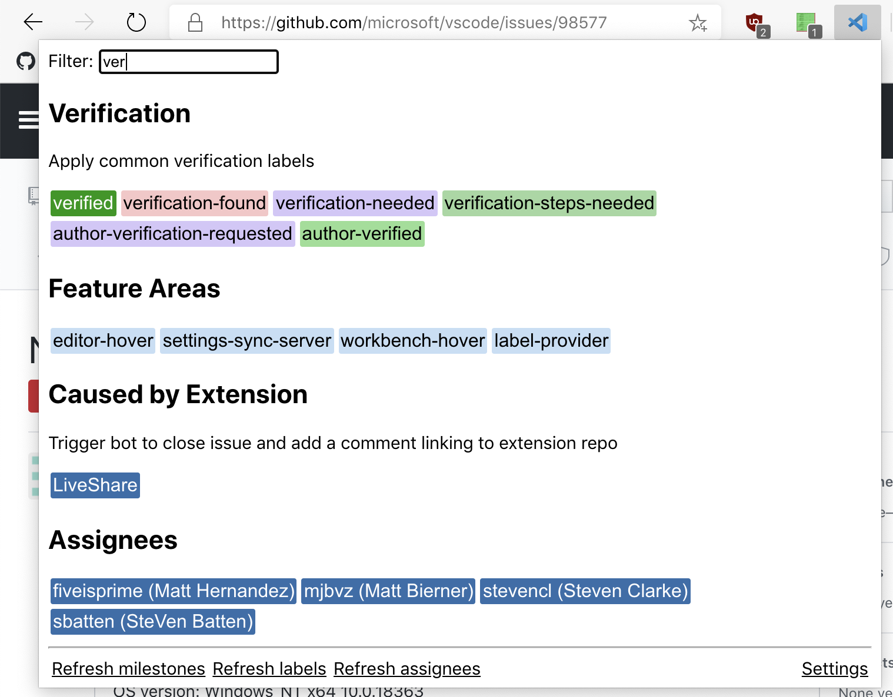

# VS Code Issue Triage Extension

This is a chromium extension to help with triaging GitHub issues. It was originally developed for our work in the [microsoft/vscode](https://github.com/microsoft/vscode) repo, but it can be used on any GitHub repo.



## Install

You can pull the latest release from the [releases page](https://github.com/microsoft/vscode-github-triage-extension/releases) and unzip it. Then, navigate to your extension configuration page (edge://extensions/, for instance), and make sure "Developper Mode" is enabled. There should be an option to "Load Unpacked". Select this, then choose the folder you uppacked prior.

## Usage

Enter in search to accept first result. Tab/ArrowKeys to move around in results. Enter/Space to accept results. Cmd with the action to multi-select.

## Configuration

Use the `Settings` link at bottom of the popup to view and edit the JSON representation of your commands. The supported file takes the form (as typescript):
```ts
type Settings = { [repo: string]: Category[] }
type Category = { category: string, description: string, items: Shortcut[] }
type Shortcut = {
	title: string
	color?: string
	type: 'label' | 'comment' | 'assign' | 'milestone'
	value: string
}
```

For instance:
```json
{
  "microsoft/vscode": [
    {
      "category": "Verification",
      "description": "Apply common verification labels",
      "items": [
        {
          "color": "rgb(0, 152, 0)",
          "title": "verified",
          "type": "label",
          "value": "verified"
        },
        {
          "color": "rgb(247, 198, 199)",
          "title": "verification-found",
          "type": "label",
          "value": "verification-found"
        }
      ]
    },
    {
      "category": "Won't Fix",
      "description": "Trigger bot to close issue and add a comment explaining why",
      "items": [
        {
          "color": "rgb(226, 161, 194)",
          "title": "*as-designed",
          "type": "label",
          "value": "*as-designed"
        }
      ]
    }
  ]
}
```


# Contributing

This project welcomes contributions and suggestions.  Most contributions require you to agree to a
Contributor License Agreement (CLA) declaring that you have the right to, and actually do, grant us
the rights to use your contribution. For details, visit https://cla.opensource.microsoft.com.

When you submit a pull request, a CLA bot will automatically determine whether you need to provide
a CLA and decorate the PR appropriately (e.g., status check, comment). Simply follow the instructions
provided by the bot. You will only need to do this once across all repos using our CLA.

This project has adopted the [Microsoft Open Source Code of Conduct](https://opensource.microsoft.com/codeofconduct/).
For more information see the [Code of Conduct FAQ](https://opensource.microsoft.com/codeofconduct/faq/) or
contact [opencode@microsoft.com](mailto:opencode@microsoft.com) with any additional questions or comments.
